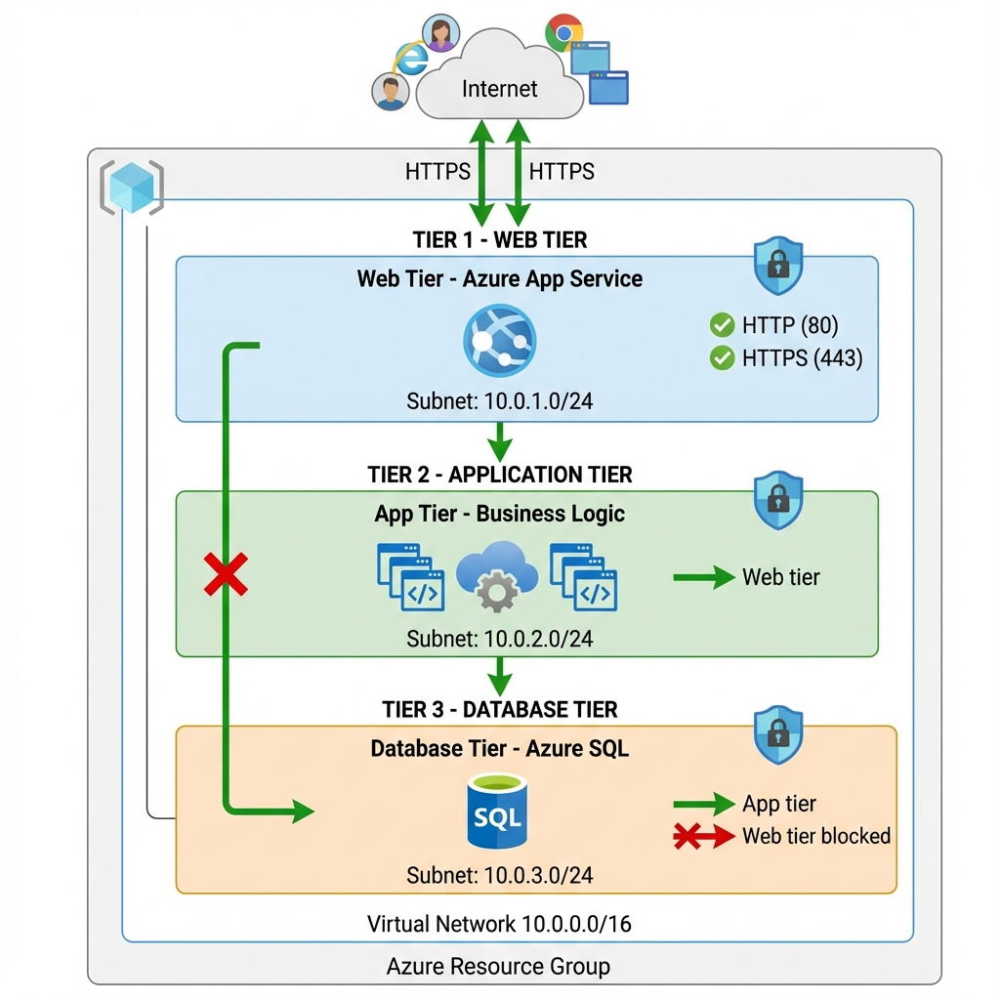

# 🏗️ Azure Three-Tier Architecture with Terraform
 
 Implementation of the classic three-tier architecture on Microsoft Azure using Terraform.
---
## 📋 Table of Contents

- [Architecture Overview](#-architecture-overview)
- [Components](#-components)
- [Prerequisites](#-prerequisites)
- [Quick Start](#-quick-start)
- [Configuration](#-configuration)
- [Security Features](#-security-features)
- [Cost Estimation](#-cost-estimation)
- [Cleanup](#-cleanup)
- [Interview Preparation](#-interview-preparation)
- [Contributing](#-contributing)

---
### 📊 Architecture Diagram



---

## 🧩 Components

| Tier | Component | Azure Service | Purpose |
|------|-----------|---------------|---------|
| **Network** | Virtual Network | Azure VNet | Isolated network with 10.0.0.0/16 CIDR |
| **Network** | Subnets | 3 Subnets | Tier isolation (Web/App/DB) |
| **Network** | NSGs | Network Security Groups | Layer 4 firewall rules |
| **Web** | Frontend | Azure App Service (Linux) | Hosts web application |
| **Database** | Data Store | Azure SQL Database | Managed relational database |

---

## 📌 Prerequisites

Before you begin, ensure you have:

- [x] **Azure Subscription** - [Student Account](https://azure.microsoft.com/free/)
- [x] **Terraform** >= 1.0 - [Install guide](https://learn.hashicorp.com/tutorials/terraform/install-cli)

---

## ⚙️ Configuration

### Variables

| Variable | Description | Default |
|----------|-------------|---------|
| `sql_admin_username` | SQL Server admin username | `sqladmin` |
| `sql_admin_password` | SQL Server admin password | *Required* |

### Customization

Modify `main.tf` to:
- Change Azure region (default: `Australia East`)
- Adjust subnet CIDR ranges
- Scale App Service plan tier
- Add additional security rules

---

## 🔐 Security Features

| Feature | Implementation |
|---------|----------------|
| **Network Segmentation** | Three isolated subnets with dedicated NSGs |
| **Defense in Depth** | Layered security - Web → App → DB |
| **Least Privilege** | Each tier only accepts traffic from previous tier |
| **No Direct DB Access** | Database only accessible from App tier |
| **Sensitive Variables** | SQL password marked as sensitive |
| **HTTPS Support** | NSG rules allow port 443 |

---

## 💰 Cost Estimation

> **Note**: Costs vary by region and usage. Below are approximate monthly costs for East US.

| Resource | SKU | Est. Monthly Cost |
|----------|-----|------------------|
| App Service Plan | B1 (Basic) | ~$13 |
| Azure SQL Database | Basic | ~$5 |
| Virtual Network | Standard | Free |
| NSGs | Standard | Free |
| **Total** | | **~$18/month** |

> 💡 **Tip**: Use Azure Cost Management to set budget alerts!

---

## 🧹 Cleanup

To avoid ongoing charges, destroy the infrastructure:

```bash
terraform destroy
```

Type `yes` when prompted to confirm deletion.
---

## 📁 Project Structure

```
📦 azure-three-tier-terraform/
├── 📄 main.tf                    # Main Terraform configuration
├── 📄 terraform.tfvars.example   # Example variables (template)
├── 📄 .gitignore                 # Git ignore rules
├── 📄 README.md                  # This file
```

---

## 🤝 Contributing

Contributions are welcome! Please:

1. Fork the repository
2. Create a feature branch (`git checkout -b feature/amazing-feature`)
3. Commit changes (`git commit -m 'Add amazing feature'`)
4. Push to branch (`git push origin feature/amazing-feature`)
5. Open a Pull Request

---

## 📄 License

This project is licensed under the MIT License - see the [LICENSE](LICENSE) file for details.

---

## 👤 Author

**Akhil**

- LinkedIn: [Your LinkedIn Profile]
- GitHub: [Your GitHub Profile]

---

<p align="center">
  <b>⭐ Star this repository if you found it helpful! ⭐</b>
</p>
